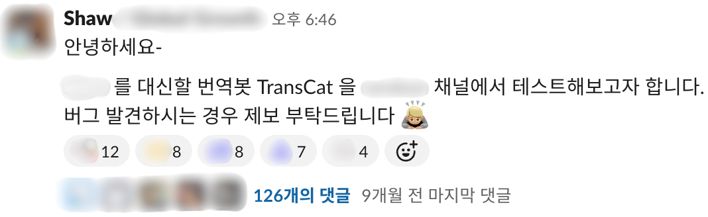
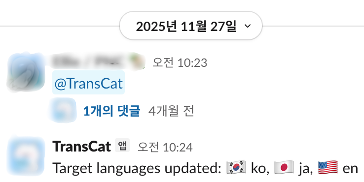
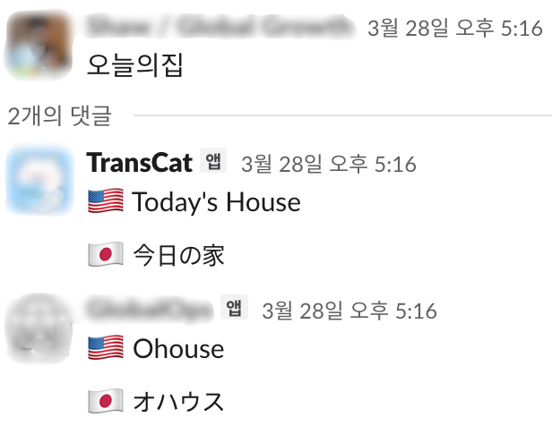

사내에서 쓰는 Slack 번역 봇 `TransCat`을 직접 만들게 된 계기는 기술적 호기심보다 훨씬 현실적인 문제에서 시작됐다. 번역 기능 자체는 오래전에도 만들 수 있었다. 그런데 막상 손대지 못했던 이유는 기술 난이도가 아니라, 누가 그걸 계속 책임지고 운영할 것이냐는 질문에 쉽게 답할 수 없었기 때문이다.

지금 돌아보면 이 프로젝트의 핵심 변화는 아키텍처보다 비용 구조에 있었다. AI 에이전트가 등장하면서 개발 자체보다 더 큰 장벽이던 실행 비용과 운영을 시작하는 부담이 낮아졌고, 그 결과 미뤄두었던 내부 유틸리티가 실제로 굴러가는 형태로 자랄 수 있었다.

## 2022년의 판단: 만들 수는 있었지만 이유는 부족했다

팀 특성상 모국어가 한국어가 아닌 구성원이 계속 늘어날 상황이었다. Slack 대화를 번역해 주는 봇이 필요했고, 그렇다고 바로 내부 개발로 가기엔 상황이 단순하지 않았다.

당시 기준으로도 Slack 번역 봇은 기술적으로 아주 어려운 문제가 아니었다. 이벤트를 받고, 언어를 감지하고, 번역 API를 붙이고, 답글을 다는 예시는 많았다.

문제는 그 다음이었다. 채널별 정책, 예외 메시지, 봇 설정, 운영 권한, 장애 대응, 품질 이슈, 그리고 "조금 불편한데 누가 언제 고칠 것인가"까지 생각하면 이야기가 달라졌다.

당시 팀은 더 직접적인 제품 과제를 우선해야 했고, 적은 백엔드 리소스를 내부 유틸리티에 장기 투입하기 어려웠다. 결국 이 문제는 `build vs buy`에서 기술 난이도가 아니라 ownership cost 때문에 `buy`로 기울었다. 외부 솔루션을 도입하는 것이 가장 현실적인 선택이었다.

## 왜 한동안 직접 만들지 않았는가

외부 솔루션을 쓰는 동안 불편이 없었던 것은 아니다. 번역 품질이 기대보다 낮다는 이야기, 채널 단위 on/off만 가능해서 스레드 단위로는 불필요한 번역이 많다는 이야기가 꾸준히 들렸다. 하지만 이 역시 "언젠가 손보면 좋겠다" 수준에 머물렀다.

이 시기에도 가볍게 직접 만드는 그림은 여러 번 떠올랐다. Slack Bot에 서버리스 런타임을 붙이는 전형적인 구조로 빠르게 만들 수도 있어 보였다. 다만 실제 조직 환경은 그런 단순한 상상을 잘 허락하지 않았다. 특정 런타임 선택에 제약이 있었고, 팀 차원에서도 새 서비스로 관리할 만큼의 강한 pain으로 인식되지는 않았다.

결국 계속 미뤄진 이유는 명확했다. 이 일은 "어려워서"가 아니라 "애매하게 계속 귀찮을 것 같아서" 손대기 어려운 종류의 작업이었다. 내부 도구는 늘 여기서 막힌다.

## 전환점: 2025년 FIW와 AI 에이전트

전환점은 2025년 상반기에 왔다. 팀 규모가 커지면서 번역 봇 비용이 "억소리 나게 나간다"는 이야기가 돌았고, 실제 확인 결과 과장된 면은 있었지만 이 주제를 다시 꺼내 보기에 충분한 계기는 됐다. 마침 [FIW](https://www.bucketplace.com/post/2023-03-10-%EC%98%A4%EB%8A%98%EC%9D%98%EC%A7%91-%EC%97%94%EC%A7%80%EB%8B%88%EC%96%B4%EB%A7%81%ED%8C%80%EC%9D%98-fix-it-week/)(Fix-it Week; 엔지니어링팀이 한 주 동안 서비스가 보완해야 할 사항과 미뤄둔 기술 부채를 집중적으로 개선하는 기간)도 가까웠다. 이전부터 머릿속에만 있던 계획을 실행해 보기로 했다.

이때 달라진 것은 단순히 시간이 생겼다는 점만이 아니었다. Cursor 같은 AI 에이전트를 실제 개발 workflow에 붙여 볼 수 있게 되면서, 작은 내부 도구를 시작하는 기준선 자체가 바뀌었다. 예전에는 내가 직접 설계와 구현, 설정, 운영 기준까지 닫아야 시작할 수 있었다면, 이 시점에는 "일단 돌아가는 0.1을 만든 뒤 개선 루프를 붙여 키운다"는 접근이 현실적인 선택지가 됐다.

초기 버전의 실행 환경은 Cloud Run으로 정했다. 조직 내에서 상대적으로 다루기 수월한 플랫폼이었고, 이미 사용 중이던 [Google Cloud Translation](https://cloud.google.com/translate/docs/overview)과도 궁합이 좋았다. 첫 버전은 기존 솔루션의 기능을 대체하되 몇 가지 불편을 바로 개선하는 데 집중했다. 대표적으로 스레드 단위 mute/unmute를 넣었고, 번역 방식에도 실험적인 아이디어를 반영했다.

이 시점의 AI 활용은 아직 구현과 초기 배포를 빠르게 진행하는 보조에 가까웠다. 0.1을 띄우는 속도는 확실히 빨라졌지만, 개선 루프가 생겼다고 보기는 어려웠다.

돌이켜 보면 0.1에서 가장 많은 시간을 쓴 것은 비즈니스 로직이 아니었다. Slack 앱 설정, 배포 방식, 인증, Cloud Run 적응 같은 운영 주변부였다. 코드는 AI 에이전트가 상당 부분 속도를 올려 줬지만, 앱 권한과 배포 경로, 인증 방식, 런타임 특성에 적응하는 일은 여전히 사람이 맥락을 잡고 결정해야 했다. 이 역시 내부 도구의 본질적인 비용이다. "코드 몇 줄이면 되는데 왜 안 만들었나"라는 질문은 보통 이런 비용을 빠뜨린다.

## 공식 도입이 보여준 실제 pain

첫 배포일은 2025년 7월 2일이었다. 팀 채널에 봇을 추가한 공지에는 댓글이 126개 달렸다. 단순한 환영 메시지 이상의 반응이었다. 그동안 이 문제가 여러 사람에게 실제 pain이었고, 팀 차원에서 공감대가 있었음을 보여주는 정량 신호라고 봤다.

이 지점부터 `TransCat`은 실험용 장난감이 아니라 운영 대상이 됐다. 번역이 안 되는 메시지 타입, 비공개 채널 지원, 상태 저장, 배포 안정성 같은 이슈가 빠르게 뒤따라왔다. 내부 도구가 실제로 채택되면, 기능 추가보다 먼저 운영 요건이 밀려온다.

몇 달 뒤인 2025년 11월 26일에는 전사 all-hands 채널에도 `TransCat`이 추가됐다. 적용 범위가 넓어졌다는 사실보다, 공개성이 높은 채널에 넣을 수 있을 만큼 운영 신뢰도가 올라갔다는 점이 더 중요하게 느껴졌다.

## 지속적으로 운영 가능한 시스템으로 진화시키기

배포 직후에는 새 기능보다 운영 비용을 줄이는 일부터 먼저 손댔다.

- 채널별, 스레드별 설정을 Firestore로 옮겨 재시작 이후에도 상태가 유지되도록 했다.
- QA와 PROD를 분리해 개선 작업이 실제 커뮤니케이션을 끊지 않도록 했다.
- 로컬 CLI 수동 배포를 GitHub Actions 기반 CD로 옮기고, smoke test와 릴리스 절차를 정리했다.
- 비공개 채널 지원과 커맨드 hop 축소처럼 자잘하지만 반복 비용이 큰 불편을 계속 제거했다.

이 변화들은 각각은 소소해 보여도, 합쳐 놓고 보면 TransCat을 임시로 굴리는 봇에서 계속 손볼 수 있는 운영 서비스로 바꿨다.

## 개선 루프를 만든 순간부터 성격이 달라졌다

오역 사례가 쌓이기 시작하면서, 그때부터는 "번역이 되느냐"보다 "무엇이 반복해서 틀리고 어떻게 고칠 것이냐"를 더 자주 보게 됐다.

- 오역 사례를 내부 문서에 모으기 시작하면서, 감이 아니라 사례를 기준으로 개선 방향을 잡을 수 있었다.
- 특정 언어쌍의 이중 번역은 품질을 높이기보다 환각을 만들기도 해서, 실제 사례를 바탕으로 구조를 단순화했다.
- glossary를 도입하면서 서비스 고유명사와 도메인 용어처럼 반복적으로 거슬리던 오역을 더 직접적으로 다룰 수 있게 됐다.
- 이후에는 커맨드/번역 메시지 분리, 필터 조건 정교화, fallback, 테스트 보강처럼 운영 과제가 더 작은 단위로 쪼개지기 시작했다.

내게는 glossary 도입 이후 서비스명이 더 이상 의역되지 않던 날이 각별하다. 엔지니어로서는 오래전부터 풀고 싶었지만, 엔지니어링 매니저로서는 우선순위 뒤로 미뤄 두었던 숙제 하나를 비로소 해결한 기분에 가까웠다.

이후에는 번역 모델을 전략 패턴으로 추상화하고, 사용량 통계와 테스트를 보강했다. 품질을 완전히 해결했다고 말할 수는 없지만, 적어도 반복적으로 드러나던 문제를 감이 아니라 사례를 기준으로 다루게 됐다는 점은 분명했다.

돌아보면 AI를 쓰는 방식에도 몇 번의 변곡점이 있었다. 처음에는 Cursor로 구현 비용을 낮추는 데 의미가 컸다. 이후 [Claude Code](https://docs.anthropic.com/en/docs/claude-code/getting-started)를 붙이면서부터는 개선 아이디어를 구조화하고, 변경 범위를 좁히고, 테스트와 배포 절차를 따라오게 만드는 데 드는 시간이 짧아졌다. 지금은 직접 손을 많이 움직이기보다, 현상에서 문제를 발견하게 하고 개입이 필요한 시점을 놓치지 않는 쪽에 더 가깝다.

## 개선 루프를 내 작업 공간 밖으로 옮긴 뒤

[Claude Code Channels](https://code.claude.com/docs/ko/channels)를 연결한 뒤에는 한 단계 더 달라졌다. 개선을 지시하는 공간이 로컬 PC에서 리모트 대화 공간으로 넓어졌고, 나는 TransCat을 직접 관리하는 사람이라기보다 Discord 채널을 통해 문제 해결을 지시하고 결과를 보고받는 사람에 가까워졌다. 세션이 리모트에 있으니 내 위치나 사내망, VPN 상태에 덜 묶였다. 덕분에 주 업무 PC 앞에 앉아 있지 않아도 됐다. "나중에 앉아서 고쳐야지"가 아니라, 출퇴근 중에도 이슈를 작업 단위로 쪼개 해결까지 이어 가기 쉬워진 것이다.

이 변화는 작업 속도뿐 아니라 컨텍스트 분리 측면에서도 의미가 있었다. TransCat 관리만이 아니라 개선 루프 자체가 주 업무 PC와 메인 업무 공간 밖으로 한 단계 분리되면서, 본업과 내부 도구 운영이 서로 컨텍스트를 잡아먹는 일도 줄었다.

논의부터 티켓 생성, 구현, 검증까지의 흐름이 내 PC가 아니라 리모트 세션과 그 세션이 위임한 에이전트들 위에서 돌아가기 시작한 것도 컸다. 실제로 디스코드 채널에서는 2026년 3월 말부터 4월 초 사이 일주일 새 20개의 작업이 등록됐고, 이 중 8개는 당일, 9개는 48시간 안에 닫혔다.

이런 짧은 사이클은 단순히 모델 성능보다 작업 인터페이스가 바뀐 영향이 더 컸다고 본다. 중요한 점은 "더 똑똑한 코드를 짠다"보다 "고쳐야 할 일을 미루지 않게 된다"에 가까웠다.

## 마무리

돌이켜 보면 문제는 개발 가능 여부가 아니었다. 그걸 만든 뒤 계속 운영하고 고칠 여유를 어떻게 마련하느냐가 더 어려운 질문이었다.

예전에는 그 답이 쉽게 `아니오`에 가까웠다. 기술은 어렵지 않았지만 ownership cost가 높았고, 유지보수의 첫 삽을 뜨는 부담도 컸다. 2025년 이후에는 그 균형이 달라졌다. AI 에이전트 덕분에 구현 비용만이 아니라 변경의 시작 비용, 문서화 비용, 검증 비용, 배포 비용까지 함께 낮아졌다.

그래서 이 프로젝트를 특별하게 만든 것은 "AI로 봇을 만들었다"는 사실이 아니다. 원래라면 우선순위 뒤편에서 계속 밀렸을 내부 유틸리티가, 이제는 작게 시작해 실제 운영 체계로 자랄 수 있게 됐다는 점이 더 중요했다.

앞으로 비슷한 종류의 도구를 다시 만들게 된다면, 나는 기술 스택보다 먼저 ownership cost부터 볼 것 같다. 구현보다 운영과 개선의 비용이 더 큰 문제라면, 이제는 예전보다 훨씬 더 자주 시도해 볼 만하다.
